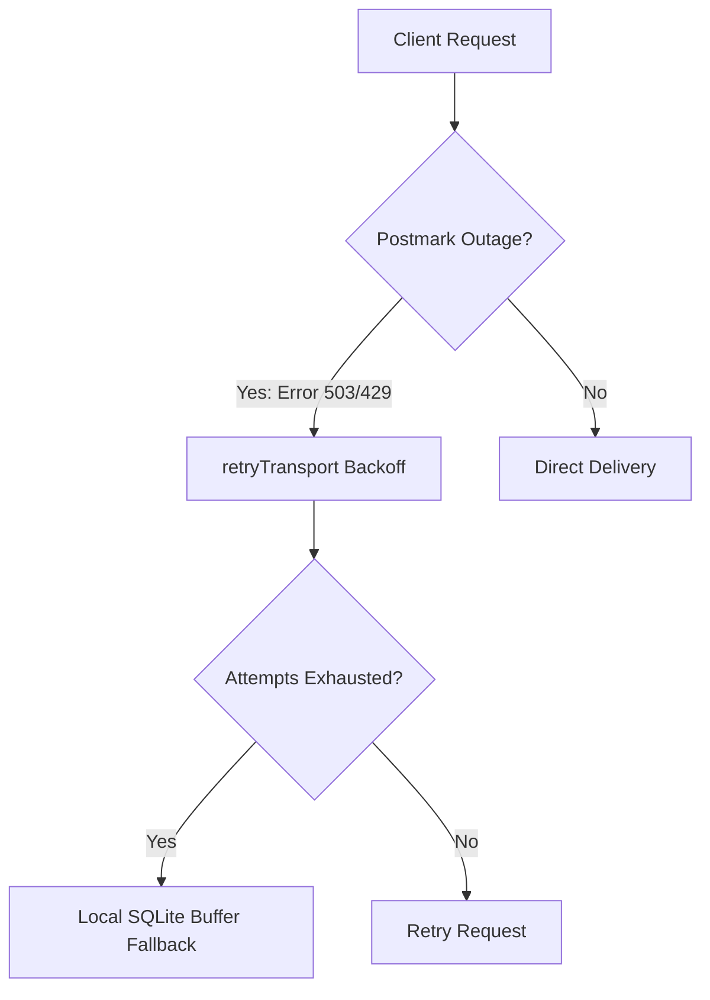

# Disaster Recovery & Release Rollback Playbook

## Operational Objective

To establish precise, repeatable, and low-friction operational guidelines for mitigating production outages, rolling back faulty package releases, retracting Go modules, and resolving continuous integration failures in our platform ecosystem.

---

## Scenario A: Rolling Back a Faulty Go Module Release

In a multi-module monorepo, a faulty release of a critical package (e.g. `go/retry`) can propagate downstream instantly. SREs and platform engineers must execute a clean rollback or retraction.

### 1. The Go Module Retraction Protocol (Recommended)

Deleting a published tag is **insufficient** because the Go Module Proxy (`proxy.golang.org`) caches packages permanently. To withdraw a faulty version and prevent downstream compilation, you must use the native Go `retract` directive.

#### Step 1: Open the `go.mod` of the affected module
Navigate to the module directory (e.g. `go/retry`) and edit `go.mod`.

#### Step 2: Append the `retract` block
Specify the buggy version (or range) and add a clear rationale:

```go
module github.com/duizendstra/alexandria/go/retry

go 1.26

// Retract v0.1.2 due to memory leak on high-concurrency transport connections.
retract v0.1.2
```

#### Step 3: Commit and Push the Retraction
1.  Commit the change using Conventional Commits:
    ```bash
    git add go.mod
    git commit -m "chore(retry): retract v0.1.2 due to transport memory leak"
    ```
2.  Tag the retraction commit as a **new version** (e.g. `v0.1.3`):
    ```bash
    git tag -a go/retry/v0.1.3 -m "Retraction of v0.1.2"
    git push origin go/retry/v0.1.3
    ```

Once indexed, any user running `go get` or `go list -m -u` will be warned, and `go get` will skip `v0.1.2` automatically.

---

## Scenario B: Hard Tag Deletion & Re-Tagging (Git Surgery)

> [!WARNING]
> Only use this method for local tag errors or if the tag was NOT successfully indexed by the public Go Module proxy. For public indices, Scenario A is mandatory.

If a tag was created erroneously on the wrong commit and needs to be moved:

### Step 1: Delete the Tag Locally & Remotely
```bash
# Delete locally
git tag -d go/retry/v0.1.2

# Delete from GitHub remote
git push origin --delete go/retry/v0.1.2
```

### Step 2: Identify the Safe Target Commit
```bash
# Locate the target Git SHA
git log --oneline -n 10
```

### Step 3: Re-create the Annotated Tag
```bash
git tag -a go/retry/v0.1.2 <target-sha> -m "Release go/retry v0.1.2"
git push origin go/retry/v0.1.2
```

---

## Scenario C: Mitigating CI/CD Pipeline Failures

If the merge/release workflow is blocked, use these recovery paths:

### 1. Buf Breaking Change Lock-In
If a backward-incompatible Protobuf change must be pushed (e.g., during active prototyping/v1alpha1 phases) but is blocked by `buf breaking`:
1.  **Do not disable the linter globally.**
2.  Add an explicit ignore rule in `contracts/buf.yaml` targeting the specific file or package:
    ```yaml
    breaking:
      ignore:
        - contracts/proto/capture/etchings/v1alpha1
    ```
3.  Commit, push, and plan to remove the ignore-override before stable `v1` tagging.

### 2. SRE Benchmark Regressions
If micro-benchmarks fail due to intentional hot-path additions:
1.  Audit memory profiles using `go test -bench -cpuprofile -memprofile`.
2.  If the allocation increase is unavoidable and approved by SRE, update the benchmark assertion boundaries in the target test suite or pipeline configuration.

---

## Scenario D: Third-Party Vendor API Failover

When integrations with key vendors (e.g., Postmark email API) suffer a major outage:

### 1. Error Status Verification
Verify that client adapters correctly catch `ErrRateLimited` (429) or `ErrServerError` (5xx). These statuses are routed to the `retry` loop.

### 2. Manual Circuit-Breaker Trigger
If the vendor outage is prolonged, SREs can manually flag the service state to activate secondary fallbacks (e.g. queueing mails locally in SQLite/BigQuery instead of streaming synchronously to Postmark).


